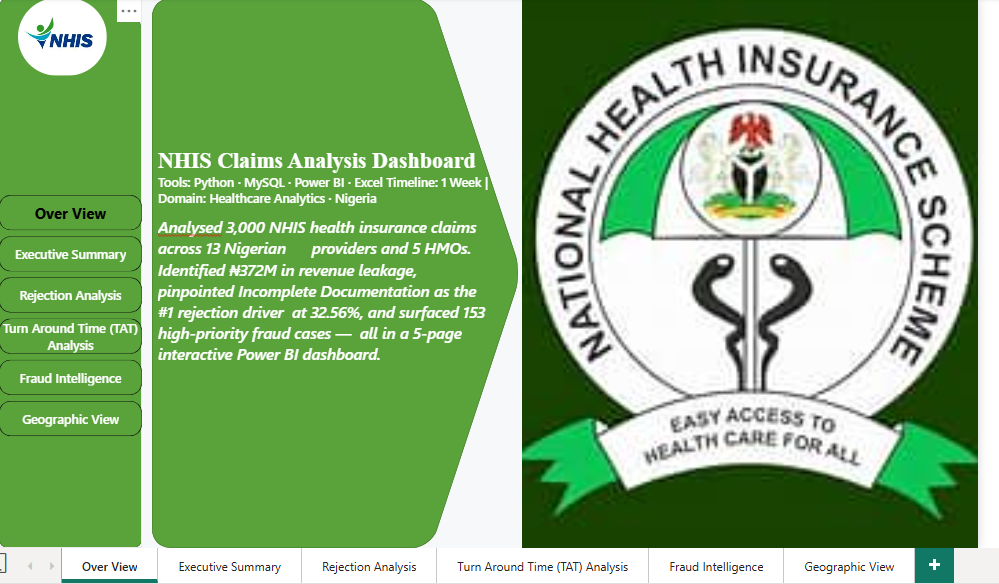
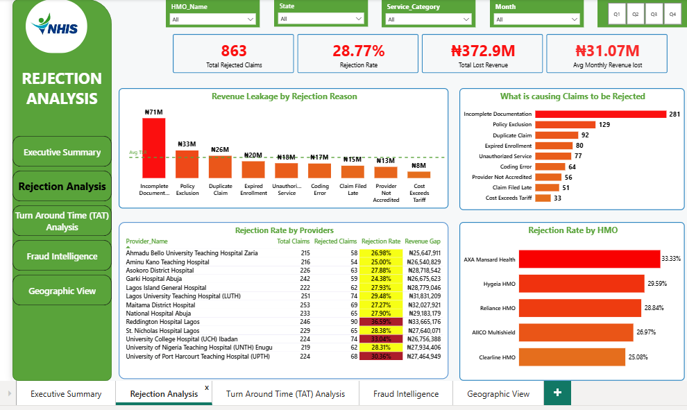
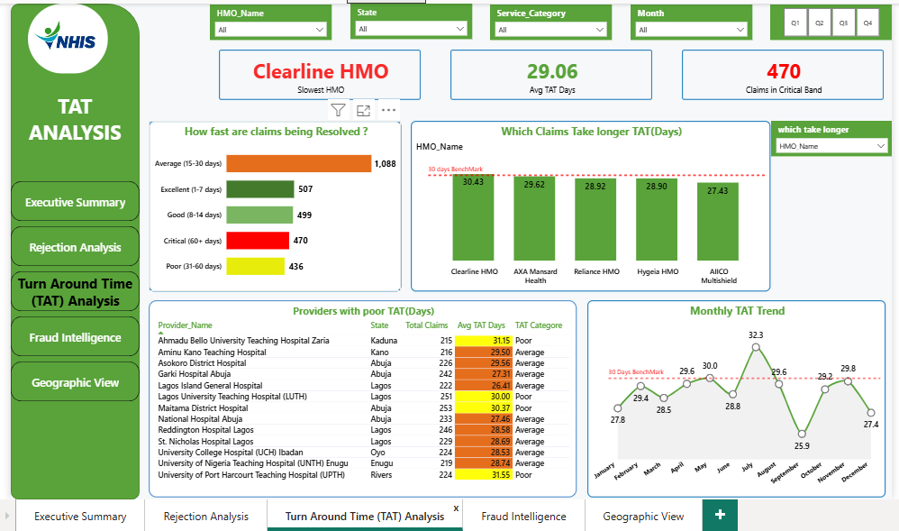
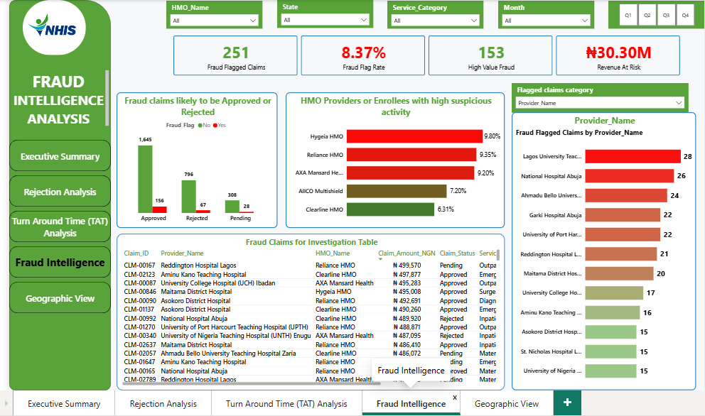
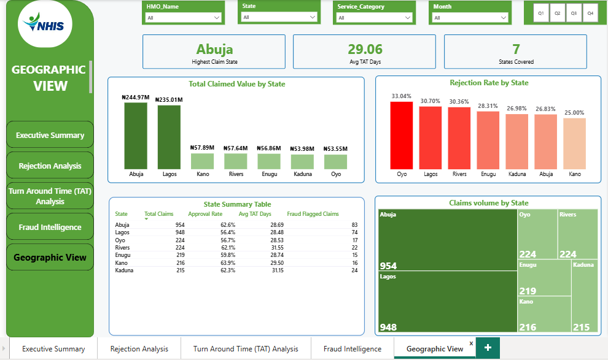

# 🏥 NHIS Claims Analysis Dashboard
### Uncovering Revenue Leakage, Rejection Patterns & Fraud Signals Across Nigeria's Health Insurance System

<br/>


> *Replace the image above with a banner screenshot of your full Executive Summary page*

<br/>

---

## 📑 Table of Contents

- [Project Overview](#-project-overview)
- [Business Problem](#-business-problem)
- [Business Goals](#-business-goals)
- [Dataset Information](#-dataset-information)
- [Tools Used](#-tools-used)
- [Data Cleaning & Transformation](#-data-cleaning--transformation)
- [Analysis Focus Areas](#-analysis-focus-areas)
- [Key Insights](#-key-insights)
- [Dashboard](#-dashboard)
- [Recommendations](#-recommendations)
- [Conclusion](#-conclusion)
- [Stakeholders](#-stakeholders)
- [Author](#-author)

---

## 🔍 Project Overview

Nigeria's health insurance system processes thousands of claims every month across a network of hospitals, clinics, and Health Maintenance Organisations (HMOs). Despite the scale of the system, most providers operate with little visibility into **why claims are being rejected**, **how long payments are taking**, and **where fraud is concentrated**.

This project builds a **five-page interactive Power BI dashboard** that analyses **3,000 NHIS health insurance claims** across **13 Nigerian hospital providers** and **5 HMOs** — giving decision-makers a single, unified view of their entire claims operation.

The dashboard was built end-to-end in one week using a fully documented data pipeline:

```
Python (Data Generation) → Jupyter Notebook (Cleaning) → MySQL (Analysis) → Power BI (Dashboard)
```

> **Domain advantage:** This project is informed by a background in Human Anatomy — providing genuine clinical context behind the data, not just chart-building.

---

## 💼 Business Problem

Nigerian hospitals and HMOs face three interconnected operational crises that go largely untracked:

**1. Revenue Leakage**
Hospitals submit claims for care they have already delivered — but a significant portion of those claims are rejected or only partially approved. The revenue is lost silently, with no clear root cause analysis to guide corrective action.

**2. Slow Payment Turnaround**
Many HMOs take weeks — sometimes months — to process and pay claims. This creates a cash flow crisis for providers, particularly smaller private clinics that rely on timely reimbursements to pay staff and purchase supplies.

**3. Undetected Fraud**
Without a structured analytical layer, suspicious claim patterns go unnoticed. Duplicate billing, phantom services, and upcoding quietly drain the fund — at an estimated industry rate of 10–15% of all claims.

> Without data visibility into these three problems, no intervention is possible. This dashboard provides that visibility.

---

## 🎯 Business Goals

This dashboard was designed to answer eight core business questions:

| # | Business Question | Dashboard Page |
|---|---|---|
| 1 | What is the overall claim approval rate across the system? | Executive Summary |
| 2 | How much revenue is being lost monthly to rejections? | Executive Summary |
| 3 | What are the most common reasons claims are being rejected? | Rejection Analysis |
| 4 | Which HMOs and providers have the highest rejection rates? | Rejection Analysis |
| 5 | How long does it take HMOs to process and pay claims? | Turnaround Time |
| 6 | Which HMOs are taking the longest to resolve claims? | Turnaround Time |
| 7 | Where are fraud signals concentrated by provider and service type? | Fraud Intelligence |
| 8 | Which Nigerian states generate the most claim volume and highest rejection rates? | Geographic View |

---

## 📊 Dataset Information

The dataset is a **synthetically generated** NHIS claims dataset built using domain-accurate parameters to mirror the real Nigerian health insurance environment. Synthetic data is standard practice in healthcare analytics portfolios due to the confidential nature of real HMO data.

| Attribute | Details |
|---|---|
| **Total Records** | 3,000 claims |
| **Time Period** | January 2024 — December 2024 |
| **Providers** | 13 Nigerian hospitals across 7 states |
| **HMOs** | 5 (Reliance HMO, Hygeia HMO, AXA Mansard Health, AIICO Multishield, Clearline HMO) |
| **States Covered** | Abuja, Lagos, Kano, Rivers, Oyo, Enugu, Kaduna |
| **Generation Tool** | Python (pandas, numpy) — Jupyter Notebook |

### Dataset Columns

| Column | Type | Description |
|---|---|---|
| Claim_ID | Text | Unique claim identifier (CLM-00001 format) |
| Patient_ID | Text | Anonymised patient identifier |
| Provider_Name | Text | Hospital or clinic that submitted the claim |
| State | Text | Nigerian state — always linked to provider location |
| HMO_Name | Text | Health Maintenance Organisation |
| Date_Submitted | Date | When the claim was submitted |
| Date_Resolved | Date | When the HMO made a decision |
| Claim_Amount_NGN | Integer | Total amount claimed (₦) |
| Approved_Amount_NGN | Integer | Amount the HMO agreed to pay (₦) |
| Claim_Status | Text | Approved / Rejected / Pending |
| Rejection_Reason | Text | Why the claim was rejected (N/A if not rejected) |
| Service_Category | Text | Outpatient / Inpatient / Surgery / Maternity / Emergency / Diagnostics |
| Diagnosis_Code | Text | ICD-10 international diagnosis code |
| Diagnosis_Name | Text | Full diagnosis name |
| Fraud_Flag | Text | Yes / No — suspicious claim indicator |
| Turnaround_Days | Integer | Days from submission to resolution |
| Month_Submitted | Text | Full month name — derived column |
| Quarter | Text | Q1 / Q2 / Q3 / Q4 — derived column |
| Approval_Gap_NGN | Integer | Claim amount minus approved amount — derived column |
| TAT_Category | Text | Performance band: Excellent / Good / Average / Poor / Critical |
| High_Value_Flag | Text | Yes if claim is greater than or equal to 200,000 NGN |

---

## 🛠️ Tools Used

| Tool | Purpose |
|---|---|
| **Python** (Jupyter Notebook) | Dataset generation, data cleaning, feature engineering |
| **pandas & numpy** | Data manipulation, null handling, derived column creation |
| **MySQL** | Structured KPI queries, data validation, analytical logic |
| **Power BI Desktop** | Five-page interactive dashboard, DAX measures, visualisations |
| **Microsoft Excel** | Data inspection, intermediate storage between pipeline stages |

---

## 🧹 Data Cleaning & Transformation

The raw dataset was cleaned and validated across **9 structured quality checks** in Jupyter Notebook before loading into MySQL and Power BI.

### Cleaning Steps

| Step | Action | Business Reason |
|---|---|---|
| 1 | Loaded dataset from Excel and inspected structure | Establish baseline understanding before any changes |
| 2 | Converted Date columns from text to datetime format | Enables turnaround time calculations and date filtering |
| 3 | Confirmed financial columns as integer type | Prevents decimal rounding errors in aggregations |
| 4 | Analysed all null values — intentional vs error | Rejection_Reason is correctly null for non-rejected claims |
| 5 | Replaced null Rejection_Reasons with "N/A — Not Rejected" | Prevents blank segments in Power BI visuals |
| 6 | Checked for duplicate Claim_IDs | Duplicates would inflate counts and distort every KPI |
| 7 | Ran 5 business logic validation rules | Ensures data is logically sound, not just technically clean |
| 8 | Engineered 5 new derived columns | Increases analytical value without adding new data |
| 9 | Exported cleaned dataset as separate file | Preserves original raw data — professional best practice |

### Business Logic Rules Validated

- ✅ Date_Resolved is never before Date_Submitted
- ✅ Rejected claims always have Approved_Amount = 0
- ✅ Approved_Amount never exceeds Claim_Amount
- ✅ Every rejected claim has a documented Rejection_Reason
- ✅ Turnaround_Days is always greater than zero

### Derived Columns Created

| Column | Logic | Purpose |
|---|---|---|
| Month_Submitted | Full month name from Date_Submitted | Monthly trend charts |
| Quarter | Q1–Q4 from submission date | Quarterly performance comparison |
| Approval_Gap_NGN | Claim_Amount minus Approved_Amount | Revenue leakage per claim |
| TAT_Category | Performance band from Turnaround_Days | Instant visual classification of processing speed |
| High_Value_Flag | Yes if Claim_Amount is 200,000 NGN or above | Priority flag for high-risk claims |

---

## 🔎 Analysis Focus Areas

### 1. Claim Approval Performance
Measuring the overall approval rate and understanding the financial gap between what is claimed and what is paid — broken down by HMO, provider, service type, and time period.

### 2. Rejection Root Cause Analysis
Identifying the specific reasons claims are being rejected, quantifying the revenue lost per rejection category, and surfacing which providers and HMOs have the highest rejection rates.

### 3. Turnaround Time Efficiency
Benchmarking how long each HMO takes to resolve claims against industry standards — identifying which providers are in a cash flow crisis zone due to slow payment cycles.

### 4. Fraud Signal Detection
Cross-referencing fraud flags with claim value, provider name, and service category to produce a prioritised investigation shortlist — moving from a haystack to a shortlist.

### 5. Geographic Distribution
Mapping claim volume, rejection rates, and turnaround time by Nigerian state to reveal regional performance gaps that are invisible in national-level reporting.

---

## 💡 Key Insights

### 📌 Insight 1 — Nearly Half of All Claimed Revenue Is Lost
> The overall approval rate stands at **60.03%**, meaning nearly 4 in every 10 claims submitted goes unpaid.
> Total revenue leakage across 3,000 claims reached **₦372,865,250** — representing **49% of all money claimed**.
> On average, **₦31,072,104 disappears every single month**.

### 📌 Insight 2 — The Biggest Problem Is a Paperwork Problem
> **Incomplete Documentation** is the single largest driver of claim rejections at **32.56%** of all rejections.
> This is an **operational failure, not a clinical one** — it does not require medical intervention.
> A structured pre-submission checklist at the hospital billing level is a zero-cost fix with multi-million naira recovery potential.

### 📌 Insight 3 — AXA Mansard Health Has the Highest HMO Rejection Rate
> At **33.33%**, AXA Mansard Health rejects 1 in every 3 claims it receives.
> This is significantly above a healthy benchmark of 10–15%, indicating either overly strict adjudication processes or a mismatch between provider documentation standards and HMO requirements.

### 📌 Insight 4 — Reddington Hospital Lagos Is the Highest-Risk Provider
> With a **36.59% rejection rate**, Reddington Hospital Lagos has the highest provider-level rejection rate in the dataset.
> This represents a significant operational problem at the billing and documentation level that is costing the hospital revenue every month.

### 📌 Insight 5 — 470 Claims Are in the Critical Turnaround Band
> **470 claims (15.67%)** fell into the Critical turnaround band — taking **over 60 days** to resolve.
> **Clearline HMO** recorded the slowest average processing time across all HMOs.
> The overall system average of **29.06 days** sits on the border between Average and Poor performance.

### 📌 Insight 6 — 153 Claims Need Urgent Investigation
> **153 claims** are simultaneously **high-value AND fraud-flagged** — representing the highest-priority investigation targets.
> **Lagos University Teaching Hospital** led all providers with **28 fraud-flagged claims**.
> These are concentrated, not scattered — which makes them immediately actionable.

### 📌 Insight 7 — Oyo State Has a Hidden Rejection Problem
> While **Abuja** generates the highest claim volume at **₦244,974,965**, it is **Oyo State** that has the most severe rejection problem at **33.04%** — the highest of any state in the dataset.
> This regional disparity is invisible without geographic-level analytics.

---

## 📈 Dashboard

The dashboard is built in **Power BI Desktop** across five pages. Each page is designed for a specific stakeholder and business question.

---

### Page 1 — Executive Summary
> *Audience: CFO, HMO Director, Hospital Administrator*
> *Question: What is the overall health of our claims system?*


> 📸 

**What this page shows:**
- 6 KPI Cards: Total Claims · Approval Rate · Avg Turnaround · Fraud Flag Rate · Total Claimed · Revenue Leakage
- Monthly claim volume trend line chart
- Claim status donut chart (Approved / Rejected / Pending)
- Claims by HMO bar chart
- TAT performance band donut chart
- Revenue summary — Total Claimed vs Total Approved vs Revenue Gap

---

### Page 2 — Rejection Analysis
> *Audience: Operations Manager, Hospital Billing Team, HMO Claims Department*
> *Question: Why are claims being rejected and where is revenue leaking?*


> 📸 

**What this page shows:**
- Top rejection reasons by claim count (bar chart)
- Revenue lost by rejection reason in NGN (bar chart)
- Provider rejection rate table with conditional formatting
- Rejection rate by HMO (bar chart)
- KPI Cards: Total Rejected · Revenue Lost · Rejection Rate

---

### Page 3 — Turnaround Time Analysis
> *Audience: Hospital Finance Manager, HMO Operations Team*
> *Question: Which HMOs and providers are slowest to pay?*


> 📸

**What this page shows:**
- TAT performance band distribution bar chart (colour-coded: Excellent to Critical)
- Average TAT by HMO bar chart with 30-day benchmark line
- Provider-level TAT table with conditional formatting
- TAT by service category bar chart
- Monthly TAT trend line chart
- KPI Cards: Avg TAT · Claims in Critical Band · Slowest HMO

---

### Page 4 — Fraud Intelligence
> *Audience: Compliance Officer, HMO Risk Team, Audit Department*
> *Question: Where are the highest-risk fraud signals concentrated?*


> 📸

**What this page shows:**
- Fraud flags by provider bar chart
- Fraud flags by service category bar chart
- High-value and fraud-flagged claims investigation table
- Fraud flag rate by HMO bar chart
- Fraud vs claim status stacked bar chart
- KPI Cards: Total Fraud Flagged · Fraud Rate · High Value Fraud · Revenue at Risk

---

### Page 5 — Geographic View
> *Audience: NHIA Officer, Regional Manager, Policy Maker*
> *Question: Which states drive the most claim volume and highest rejection rates?*


> 📸 

**What this page shows:**
- Claims volume by state bar chart
- Total claimed value by state bar chart (NGN)
- Rejection rate by state bar chart with conditional formatting
- State summary table: Volume · Claimed · Approval Rate · Avg TAT · Fraud Flags
- KPI Cards: States Covered · Highest Volume State · System Avg TAT

---

## ✅ Recommendations

Based on the analysis, the following actions are recommended in order of impact and ease of implementation:

### 🔴 Priority 1 — Fix Documentation at the Source (Immediate, Zero Cost)
**Finding:** Incomplete Documentation drives 32.56% of all rejections.
**Action:** Implement a mandatory pre-submission checklist at every provider's billing desk. Train billing staff on HMO documentation requirements specific to each service category.
**Estimated Impact:** A 60% reduction in documentation rejections could recover approximately **₦7.2M per month**.

### 🔴 Priority 2 — Investigate the 153 High-Value Fraud Cases (Immediate)
**Finding:** 153 claims are simultaneously high-value and fraud-flagged.
**Action:** Assign a dedicated audit team to review these claims. Cross-reference with patient records, admission logs, and prescription data.
**Estimated Impact:** Recovery or prevention of potentially tens of millions in fraudulent payments.

### 🟠 Priority 3 — Address Clearline HMO's Turnaround Crisis (Short-Term)
**Finding:** Clearline HMO has the slowest claims processing time, with significant claims in the Critical (60+ day) band.
**Action:** Conduct an operational audit of Clearline HMO's adjudication process. Set contractual turnaround time SLAs with financial penalties for non-compliance.
**Estimated Impact:** Improved hospital cash flow and reduced risk of providers refusing to accept Clearline enrollees.

### 🟠 Priority 4 — Engage AXA Mansard Health on Their 33.33% Rejection Rate (Short-Term)
**Finding:** AXA Mansard Health rejects 1 in 3 claims — the highest HMO rejection rate.
**Action:** Schedule a structured provider-HMO alignment meeting. Review adjudication guidelines and identify whether the issue is documentation quality or HMO-side policy interpretation.
**Estimated Impact:** If rejection rate drops to 15%, AXA Mansard providers recover an estimated **₦12M+ in monthly revenue**.

### 🟡 Priority 5 — Launch a Targeted Oyo State Intervention (Medium-Term)
**Finding:** Oyo State has the highest rejection rate at 33.04% despite not being the highest-volume state.
**Action:** Conduct state-level provider training, documentation audits, and HMO relationship reviews specific to the Oyo State provider network.
**Estimated Impact:** Bringing Oyo's rejection rate in line with the national average unlocks significant additional revenue for UCH Ibadan and affiliated providers.

### 🟡 Priority 6 — Implement Real-Time Claims Monitoring (Medium-Term)
**Finding:** The current system has no early-warning mechanism for rejection spikes or turnaround deterioration.
**Action:** Deploy a live Power BI Service dashboard connected to the HMO's claims database — enabling weekly rather than monthly performance reviews.
**Estimated Impact:** Earlier detection of rejection spikes could prevent months of accumulated revenue loss.

---

## 📝 Conclusion

This project demonstrates that Nigeria's health insurance claims system is not primarily suffering from a medical problem or even a fraud problem — **it is suffering from an operations problem.**

Nearly half of all claimed revenue — **₦372,865,250 across 3,000 claims** — is not reaching the hospitals that earned it. The dominant cause is incomplete documentation: a process failure that can be fixed with training, checklists, and accountability — not capital expenditure.

The data also reveals a system where turnaround time is putting small providers under cash flow pressure, fraud signals are concentrated enough to be actionable with the right tools, and geographic disparities like Oyo State's silent rejection crisis are invisible without state-level analytics.

Data analytics does not just describe these problems — it quantifies them, locates them, and prioritises the solutions. That is the value this dashboard was built to deliver.

---

## 👥 Stakeholders

This dashboard was designed to serve multiple stakeholders simultaneously — each finding what they need on the page built for them:

| Stakeholder | Primary Page | Key Metric They Care About |
|---|---|---|
| CFO / Finance Director | Executive Summary | Revenue Gap and Monthly Leakage |
| HMO Operations Manager | Rejection Analysis | Rejection Rate and Top Rejection Reasons |
| Hospital Billing Team | Rejection Analysis | Provider-Level Rejection Rate |
| Hospital Finance Manager | Turnaround Time | Avg TAT Days and Cash Flow Risk |
| Compliance / Audit Officer | Fraud Intelligence | High-Value Fraud Count and Provider Flags |
| NHIA Policy Officer | Geographic View | State-Level Claim Distribution |
| Regional Health Manager | Geographic View | State Rejection Rate and Volume |

---

## ✍️ Author

**Cletus Peter | The Full Stack Data Analyst**

Data Analyst specialising in healthcare analytics and business intelligence for Nigerian startups and institutions. Background in Human Anatomy — bringing clinical domain knowledge to every data project.

| | |
|---|---|
| 🌐 **Portfolio** | https://cletuspeter.github.io/my-portfoilo/ |
| 💼 **LinkedIn** | https://www.linkedin.com/in/peter-ngwuta-cletus-290281292 |
| 🐦 **Twitter/X** | @CletusPeter17 |
| 📍 **Location** | Abuja, Nigeria |

---

> *© Cletus Peter | The Full Stack Data Analyst*
>
> *If you found this project useful or have questions about the methodology, feel free to connect on LinkedIn.*

---

### 📁 Repository Structure

```
nhis-claims-dashboard/
│
├── data/
│   ├── nhis_claims_data.xlsx          # Original raw dataset
│   └── nhis_claims_cleaned.xlsx       # Cleaned and enriched dataset
│
├── notebooks/
│   ├── day1_data_generation.ipynb     # Python data generation
│   └── day2_data_cleaning.ipynb       # Cleaning and validation
│
├── sql/
│   └── nhis_kpi_queries.sql           # All 8 KPI SQL queries
│
├── screenshots/
│   ├── banner.png                     # Dashboard banner image
│   ├── page1-executive-summary.png    # Page 1 screenshot
│   ├── page2-rejection-analysis.png   # Page 2 screenshot
│   ├── page3-turnaround-time.png      # Page 3 screenshot
│   ├── page4-fraud-intelligence.png   # Page 4 screenshot
│   └── page5-geographic.png           # Page 5 screenshot
│
├── report/
│   └── NHIS_Claims_Dashboard.pbix     # Power BI dashboard file
│
└── README.md                          # This file
```
